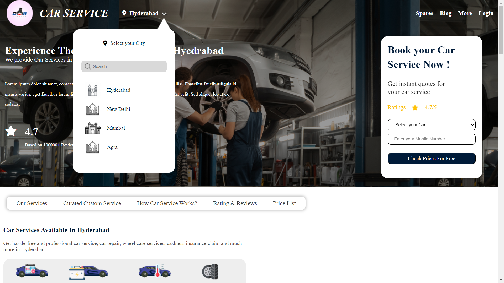
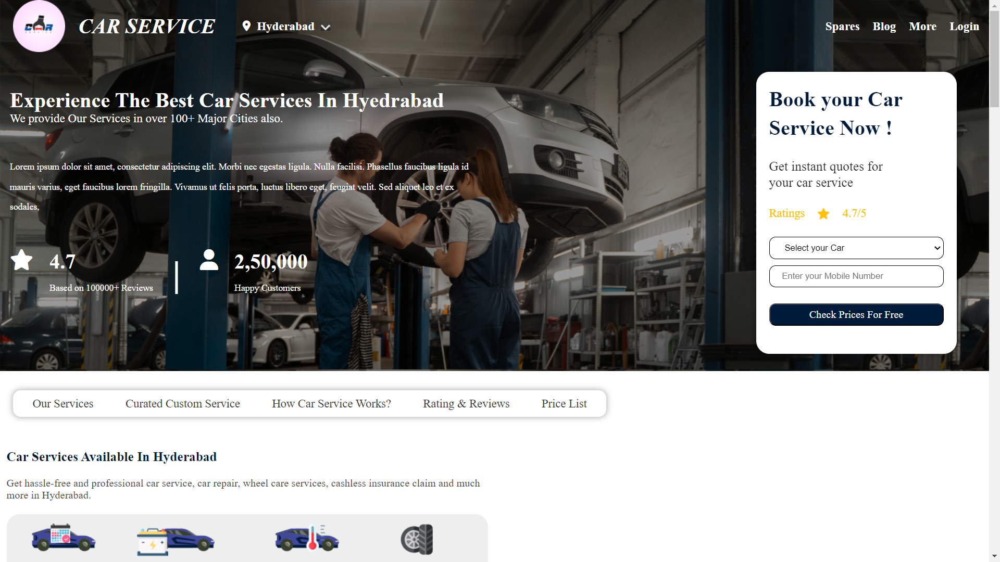
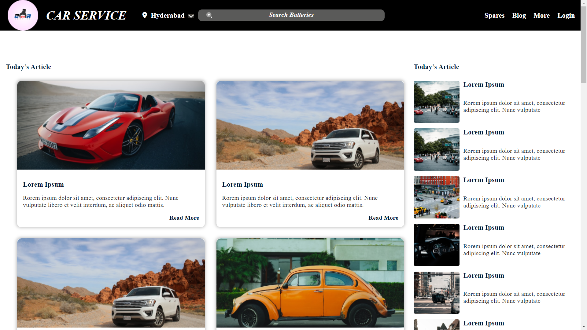
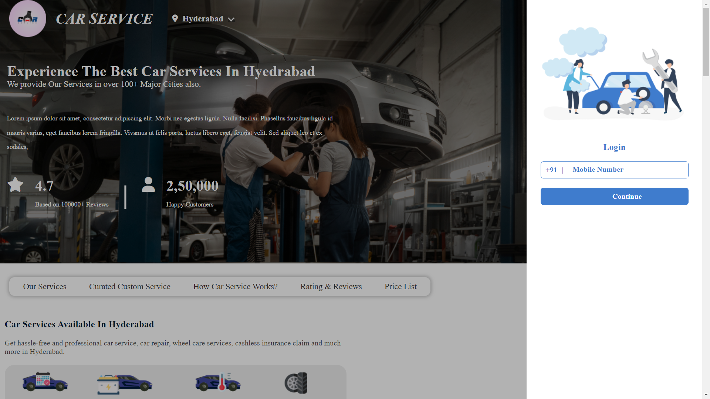
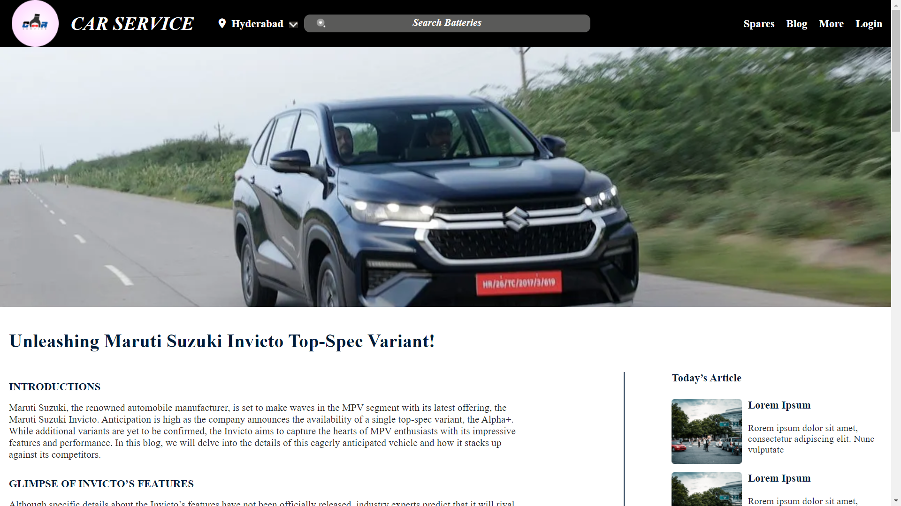
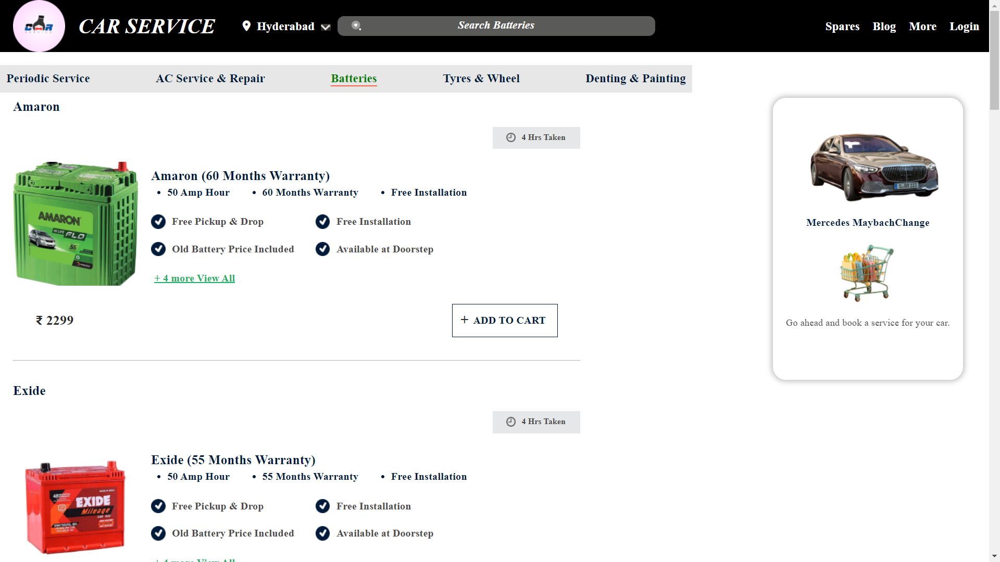
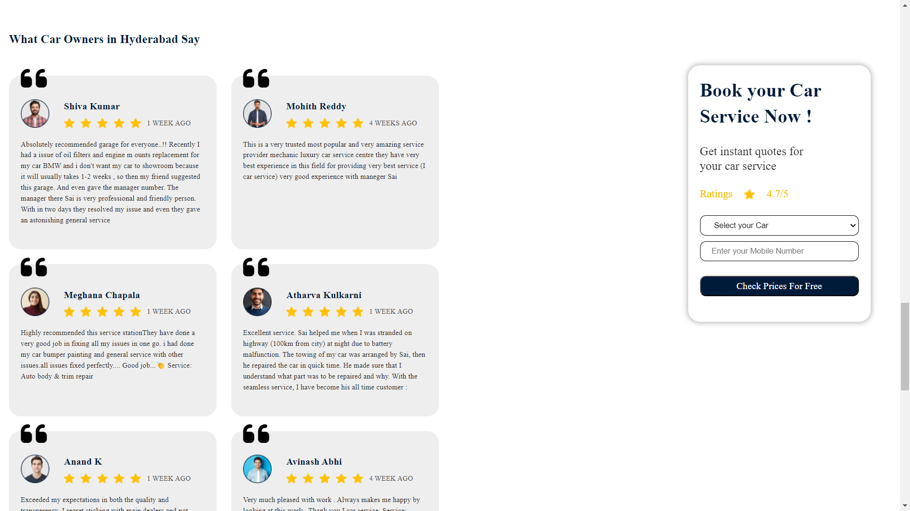
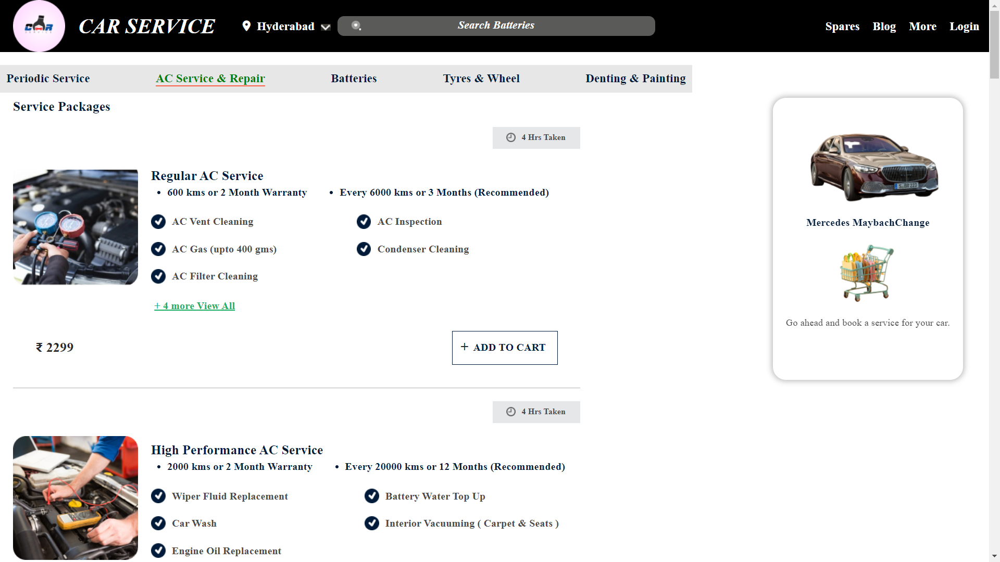
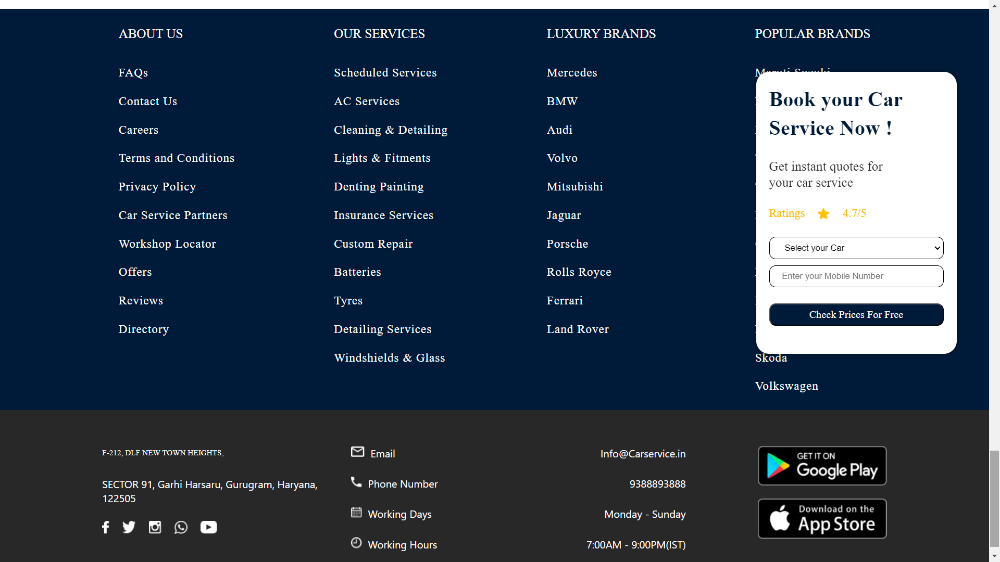

# Flyweis_technologies Application!

Welcome to the Flyweis_technologies Application! This web application allows you to browse  a collection of cars and other facilities. Explore various cars,battries etc 
## Table of Contents

- [About](#about)
- [Features](#features)
- [Getting Started](#getting-started)
- [Usage](#usage)
- [Technologies Used](#technologies-used)
- [Deployment](#deployment)
- [Contributing](#contributing)
- [License](#license)

## About

Flyweis_technologies Application! is a web application designed to help users easily access cars,battries etc
## Features

- Browse a collection of cars,battries etc.
- login with otp.

## Screenshots

## Deployment

Deployed Link:-https://flyweis-technologies.vercel.app

## Getting Started

# Clone the repository

git clone https://github.com/Abu1Osama/Flyweis_technologies.git

# Change directory

cd your-repo

# Install dependencies

npm install

# Start the development server

npm start

## Technologies Used

Flyweis_technologies Application  is built using the following technologies:

- React.js
- Axios
- JavaScript

## Usage

- Visit the application in your web browser at http://localhost:3000 or the URL https://flyweis-technologies.vercel.app/
1. Browse a collection of cars ,battries.
2. use <h1>7970663406</h1> to login.
3. click on custom text in navbar to logout.
4. use mini nav on home page and peridic page to navigate inside page.
